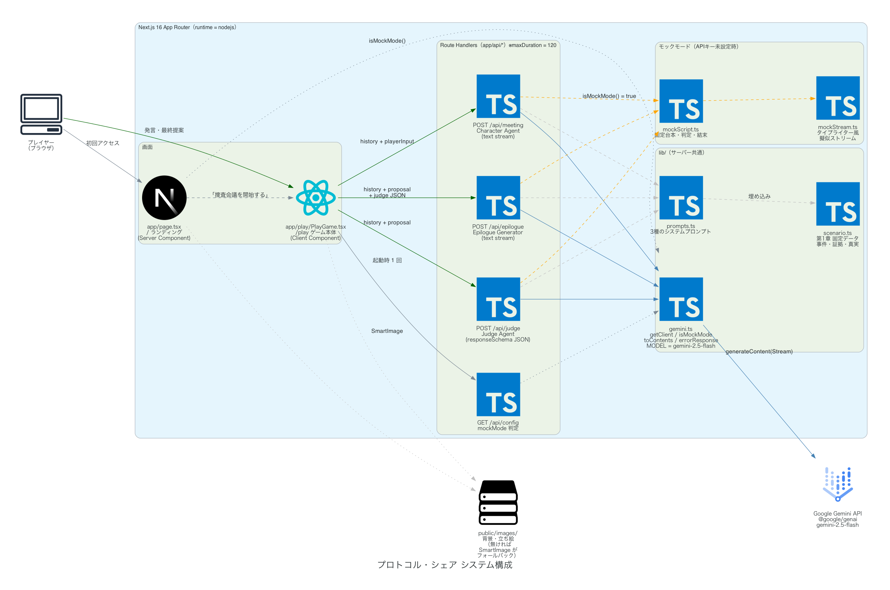

# 企画設計書：対話型ミステリWebゲーム『プロトコル・シェア（仮題）』

生成AI（LLM）のマルチエージェント技術を活用した、従来の「論破」ではなく「寄り添いと共同構築」をテーマにした次世代の捜査会議シミュレーションゲーム。

---

## 1. ゲーム概要

*   **タイトル：** プロトコル・シェア（Protocol Share）※仮題
*   **ジャンル：** 生成AI駆動型・対話ミステリアドベンチャー
*   **プラットフォーム：** Webブラウザ（PC/スマートフォン対応）
*   **開発環境（推奨）：** フロントエンド（React / Vue.js）、バックエンド（Vercel Functions等のサーバーレス環境）、生成AI（OpenAI API / Anthropic API）
*   **ターゲット層：** ミステリゲームファン、インディーゲームファン、AI技術を活用した新しいゲーム体験に関心がある層

---

## 2. コアコンセプト
*   **正論より寄り添い：** 仲間の間違いを「論破」するとゲームオーバー。感情をケアし、チームの能力を最大化する。
*   **私たち vs 事件：** 「私 vs 犯人」ではなく、チーム全員で一つの正しい捜査手順を「共同構築」する。
*   **動的エピローグ：** 会議での立ち回りと最終判断に基づき、AIがあなただけの結末（成功・失敗）をドラマチックに生成。

---

## 3. 登場人物（NPCエージェント）

会議に参加する刑事たちは、それぞれ異なる「歪み」や「目的」を持って発言します。

| キャラクター | 役割・性格 | プレイヤーへの反応 | 会議での行動 |
| :--- | :--- | :--- | :--- |
| **主人公（プレイヤー）** | 会議の進行役（主任） | - | テキスト自由入力、および進行ボタンによる舵取り。 |
| **せっかちな新人** | 焦燥と正義感、視野狭窄 | 正論で否定されると腐る。 寄り添われると協力質が向上。 | 薄い証拠で早急な強制捜査を主張。ミスリードに引っかかりやすい。 |
| **意固地なベテラン** | プライド、経験への固執 | データで論破されると心を閉ざす。 敬意を払われると重要証言を出す。 | 昔気質の足を使った捜査に固執。現代的な犯罪手口を軽視する。 |
| **真犯人の刑事** | **【黒幕】** 隠蔽と誘導 | 誰にでも優しく同調する。 一見、最も話が通じる相手。 | 新人やベテランの「間違った推理」に寄り添い、捜査を意図的に脱線させる。 |

---

## 4. ゲームシステムと画面構成（UI）

### 4.1. 画面レイアウト案
1.  **会議タイムライン（上部〜中央）：** 刑事たちの発言がログ形式で流れる。表情（立ち絵）付き。
2.  **状況表示インジケーター（右上）：** チームの「会議室の空気（冷え度）」を表示。
3.  **プレイヤー入力エリア（下部）：**
    *   **テキスト入力フォーム：** 主人公の発言を自由入力。
    *   **「発言を進める」ボタン：** 自分は喋らず、NPC同士の会話を1ターン進める。
    *   **「捜査手順を決定する」ボタン：** 会議を終了し、最終提案を提出する。

### 4.2. ゲームの基本フロー

#### 【フェーズ1：会議フェーズ】
*   プレイヤーはNPCたちの会話を聞きながら、自由にテキストを入力して介入する。
*   プレイヤーが「発言を進める」を押すと、NPCがそれぞれの性格・立場に基づいてオートで掛け合いを行う。

#### 【フェーズ2：捜査手順の決定】
*   十分な議論が行われた（またはプレイヤーが核心を突いた）段階で、「捜査手順を決定する」を選択。
*   プレイヤーは「誰を、どこを、どういう方針で捜査するか」をテキストで最終提案する。

#### 【フェーズ3：評価と判定（バックエンド処理）】
*   AI（ジャッジ役）が、会議中のログと最終提案を読み込み、内部的にスコアリングを行う（JSON出力）。
*   **評価基準：** 「新人のケア（0-20）」「ベテランの敬意（0-20）」「真犯人の誘導の回避（0-60）」
*   **ボーダーライン：** 合計70点以上で【成功】、未満で【失敗】。

#### 【フェーズ4：エピローグ生成】
*   判定結果を受け、AIがその後の捜査展開と結末を小説風に生成し、画面にタイピング演出で表示する。

---

## 5. アーキテクチャ図

現状の実装（Next.js 16 App Router + Gemini API）の構成図です。

### システム構成

